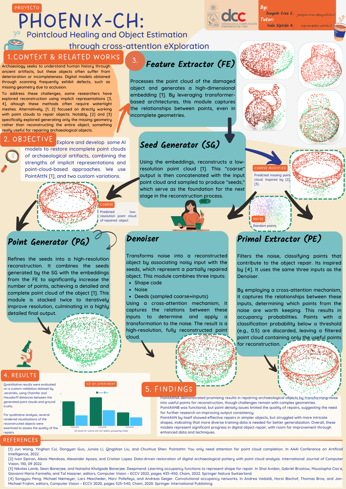

# Project Phoenix-CH: Pointcloud Healing and Object Estimation through cross-attentIon eXploration.

This repo started as a fork of [PointAttN](https://github.com/ohhhyeahhh/PointAttN). Please refer to their repo for the original implementation.
There are some implementations taken from [Convolutional Occupancy Networks](https://pengsongyou.github.io/conv_onet) too.
Please, consider visiting their original pages.

## 0. About this work


In this project, we explore and develop some AI models to restore incomplete point clouds of archaeological artifacts,
combining the strengths of implicit representations and point-cloud-based approaches.
We use [PointAttN](https://github.com/ohhhyeahhh/PointAttN), and two custom variations. 

### Motivation

Archaeology seeks to understand human history through ancient artifacts,
but these objects often suffer from deterioration or incompleteness.
Digital models obtained through scanning frequently exhibit defects, such as missing geometry due to occlusion.

To address these challenges, some researches have explored reconstruction using implicit representations
**([DeepMend](dsfs), [ConvONet](https://pengsongyou.github.io/conv_onet))**, although these methods often require watertight meshes. Alternatively,
**[PointAttN](https://github.com/ohhhyeahhh/PointAttN)** and **[DRDAP](https://github.com/ivansipiran/Data-driven-cultural-heritage)**
focused on directly working with point clouds to repair objects. Notably, **DRDAP** and **DeepMend**
specifically explored generating only the missing geometry rather than reconstructing the entire object,
something really useful for repairing archaeological objects.


## 1. Environment setup **(WIP)**

### Install related libraries

This code has been tested on Ubuntu 20.04, python 3.10.14, torch 1.13.1 with cuda 11.7, and using CUDA 12.2 in the machine.
Please install related libraries before running this code:

**WIP: requirements.txt is outdated :c**
```
pip install -r requirements.txt
```

### Compile Pytorch 3rd-party modules

please compile Pytorch 3rd-party modules [ChamferDistancePytorch](https://github.com/ThibaultGROUEIX/ChamferDistancePytorch). A simple way is using the following command:

```
cd $PointAttN_Home/utils/ChamferDistancePytorch/chamfer3D
python setup.py install
```

## 2. Train

### Prepare training datasets

Aiming for repairing cultural heritage objects, we used this [Dataset for precolombian reconstruction](https://github.com/PJaramilloV/Precolombian-Dataset.git).
In this work, I called it **CHS** instead, standing for *Cultural Heritage Sharp*.

### Train a model

To train the PointAttN, PointAttNA or PointAttNB models, modify the dataset path in `cfgs/PointAttNX.yaml `, run:

```
python train.py -c PointAttNX.yaml
```

## 3. Test **(WIP)**

### Pretrained models **(WIP)**

### Test for paper result

To test any PointAttN variation on CHS benchmark, download  the pretrained model and put it into `PointAttN_cd_debug_chs `directory, run:

```
python test_chs.py -c PointAttNX.yaml
```

## 4. Acknowledgement

1. We include the following PyTorch 3rd-party libraries:  
   [1] [ChamferDistancePytorch](https://github.com/ThibaultGROUEIX/ChamferDistancePytorch)

2. Some of the code of this project is borrowed from [VRC-Net](https://github.com/paul007pl/MVP_Benchmark)  

3. A lot of the code of this project is taken from [PointAttN](https://github.com/ohhhyeahhh/PointAttN), since this repo
stared as a fork.

4. There is also code from [Convolutional Occupancy Networks](https://pengsongyou.github.io/conv_onet) too.

## 5. Cite this work

If you use PointAttN in your work, please cite the original paper:

```
@article{Wang_Cui_Guo_Li_Liu_Shen_2024,
   title={PointAttN: You Only Need Attention for Point Cloud Completion},
   volume={38}, 
   url={https://ojs.aaai.org/index.php/AAAI/article/view/28356}, DOI={10.1609/aaai.v38i6.28356}, 
   number={6}, 
   journal={Proceedings of the AAAI Conference on Artificial Intelligence},
   author={Wang, Jun and Cui, Ying and Guo, Dongyan and Li, Junxia and Liu, Qingshan and Shen, Chunhua},
   year={2024},
   month={Mar.},
   pages={5472-5480}
}
```

